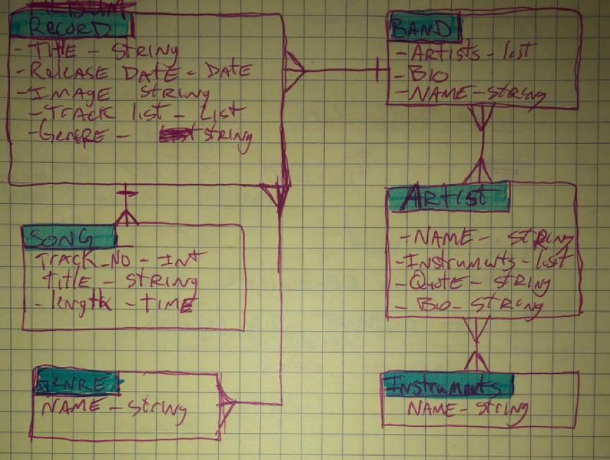
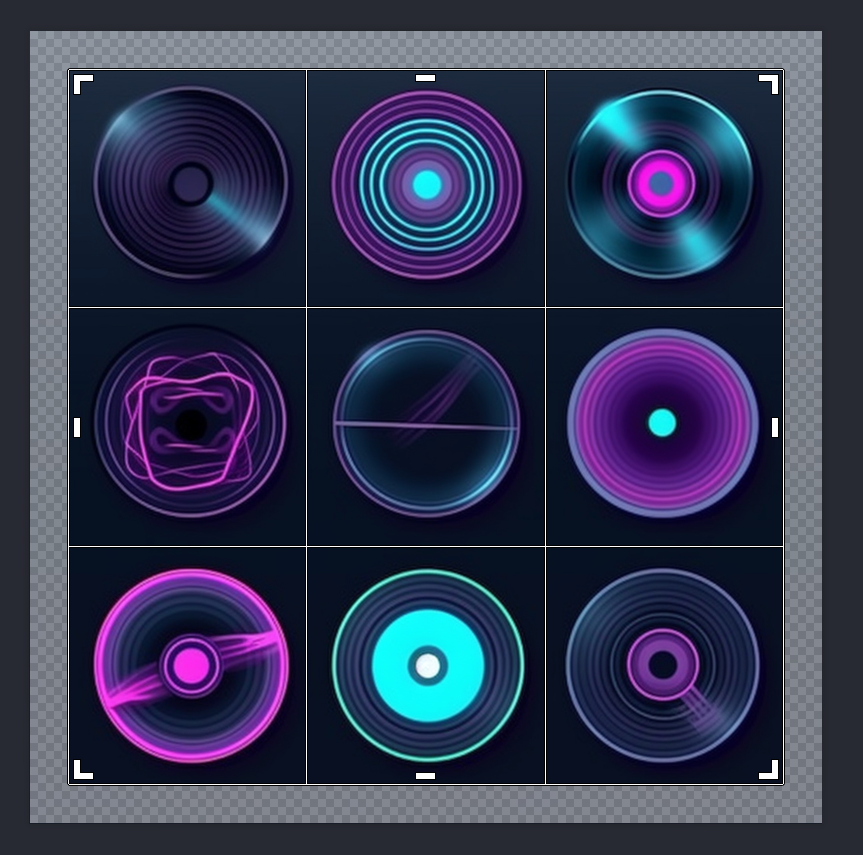
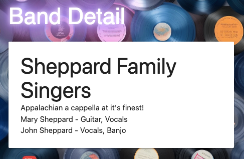

#  Record Collector

This is a django project that utilizes a Postgres database.

<br/>

##  🎯 Aim

If you know me, backend is not one of my strengths.  It's true, databases, servers, and server-side rendering are my achelies heel.  Another thing that is true; whenever I find an area in my life that needs strengthening I do not shy away.  No, I jump right in.  Record Collector is just that.  It is me jumping into a few areas of discomfort: SQL, relating tables, python, and django. 

The pourpose of this project is not all self-improvment drudgery. I also tried to have some fun.  In order to help me create this imaginary micro world of Records, Bands, Artists and Songs, I leaned on two AI programs, [Midjourney](https://www.midjourney.com/ "Midjourney Home") and [chatGPT](https://openai.com/blog/chatgpt "ChatGPT Home").

- Midjourney is text to image generating AI. I used this to generate all the album covers.  I then used [BeFunky](https://befunky.com "BeFunky Home") to edit some of the images 

- ChatGPT is text to text generating AI.  I used this to help generate some of the song titles and biographies. OK, I used it to help with some of the code as well, like the neon glow of the home page header.  

I hope you have has much fun looking through Record Collector as I had creating it!

<br/>

## 🌐 Data Mapping

Perhaps one of the most confusing aspects of working with databases for me is relating tables.  I get what is happening on a core level (basicly) and I also know how powerful relating tables can be for a developer.  I utelized a couple of 1:M relationships as well as a few M:M relatinships.  To help myself out with making sense of all the data entities I was trying to implement I drew myself a diagram of each of the data entities and the relationships between them. This is also know as an ERD (Entity Data Relationship). Here is a picture of my ERD, which I referenced constanlty while building Record Collector:



<br/>

## ✨ Favicon

I used Midjourney to make the Favicon as well, in fact I will usually make cusom favicons for web aplications I build.  I don't know what it is exactly about small icons, but I ❤️ them, a lot.  I mainly wanted to talk about icons so I could share this screen shot of me taking a set of icons Midjourney generated for me and getting ready to crop the icon I wanted.  There was something so satisfying about the crop selector tool bordering each icon so perfectly when I first pulled it up.  


<!--  -->

<br/>

## ✅ Things Coming Together

Before I  wrote the code for the M:M relationships between my `Band` >---< `Artist` >---< `Instrument` and `Record` >---< `Genre` models I was very nervous about this part.  But as I started to write it out it was pretty easy.  Below is a sample of that code. Or take a look at the [models.py](https://github.com/IntuitiveHarmony/recordCollector/blob/master/main_app/models.py "View models.py at github.com") file itself.

```python
class Instrument(models.Model):
    name = models.CharField(max_length=100)

class Artist(models.Model):
    ...
    instruments = models.ManyToManyField(Instrument)
    
class Band(models.Model):
    ...
    artists = models.ManyToManyField(Artist)
    
```

<br/>

The logic of connecting all of those tables along with their appropriate tables is pretty straight forward.  What django is doing under the hood is super impressive!  Here is the SQL it generates when the user navigates to the Band detail page:

```SQL
SELECT "main_app_band"."id", "main_app_band"."name", "main_app_band"."bio" FROM "main_app_band" WHERE "main_app_band"."id" = 1 LIMIT 21;

SELECT "main_app_artist"."id", "main_app_artist"."name", "main_app_artist"."quote", "main_app_artist"."bio" FROM "main_app_artist" INNER JOIN "main_app_band_artists" ON ("main_app_artist"."id" = "main_app_band_artists"."artist_id") WHERE "main_app_band_artists"."band_id" = 1;

SELECT "main_app_instrument"."id", "main_app_instrument"."name" FROM "main_app_instrument" INNER JOIN "main_app_artist_instruments" ON ("main_app_instrument"."id" = "main_app_artist_instruments"."instrument_id") WHERE "main_app_artist_instruments"."artist_id" = 1;

SELECT "main_app_instrument"."id", "main_app_instrument"."name" FROM "main_app_instrument" INNER JOIN "main_app_artist_instruments" ON ("main_app_instrument"."id" = "main_app_artist_instruments"."instrument_id") WHERE "main_app_artist_instruments"."artist_id" = 2;
```

<br/>

All of the SQL was sent to the database just so I could render this simple detail page, thanks django!



<br/>

