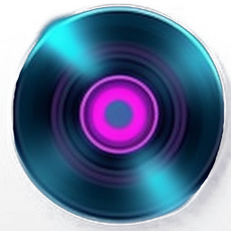

#  Record Collector

This is a django project that utilizes a Postgres database.

 

##  🎯 Aim

If you know me, backend is not one of my strengths.  It's true, databases, servers, and server-side rendering are my achelies heel.  Another thing that is true; whenever I find an area in my life that needs strengthening I do not shy away.  No, I jump right in.  Record Collector is just that.  It is me jumping into a few areas of discomfort: SQL, relating tables, python, and django. 

The pourpose of this project is not all self-improvment drudgery. I also tried to have some fun.  In order to help me create this imaginary micro world of Records, Bands, Artists and Songs, I leaned on two AI programs, [Midjourney](https://www.midjourney.com/ "Midjourney Home") and [chatGPT](https://openai.com/blog/chatgpt "ChatGPT Home").

- Midjourney is text to image generating AI. I used this to generate all the album covers.  I then used [BeFunky](https://befunky.com "BeFunky Home") to edit some of the images 

- ChatGPT is text to text generating AI.  I used this to help generate some of the song titles and biographies. OK, I used it to help with some of the code as well, like the neon glow of the home page header.  

I hope you have has much fun looking through Record Collector as I had creating it!

 

## ✨ Favicon

I used Midjourney to make the Favicon as well, in fact I will usually make cusom favicons for web aplications I build.  I don't know what it is exactly about small icons, but I ❤️ them, a lot.  I mainly wanted to talk about icons so I could share this screen shot of me taking a set of icons Midjourney generated for me and getting ready to crop the icon I wanted.  There was something so satisfying about the crop selector tool bordering each icon so perfectly when I first pulled it up.  

<!--  -->